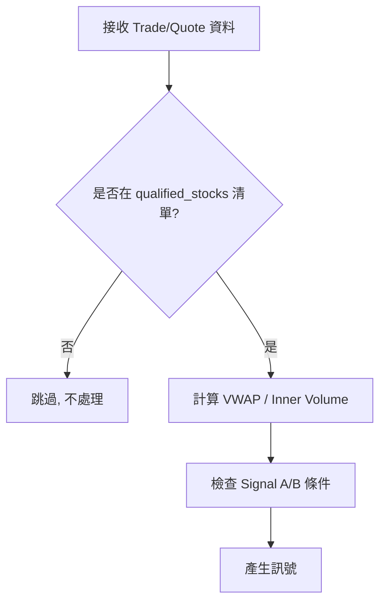

# VWAP 量縮策略回測系統 - 技術架構文件

> **Purpose**: 供外部開發者理解本系統架構，以便協助建構更完整的回測框架。  
> **Last Updated**: 2026-01-19

---

## 1. 系統概覽

本專案包含兩個主要子系統：

| 子系統 | 路徑 | 用途 |
|--------|------|------|
| **StockScreening** | `StockScreening/` | 即時盤中監控 Dashboard，產生 VWAP 量縮訊號 |
| **VWAP_SupStrat** | `VWAP_SupStrat/` | 歷史資料回測引擎，驗證策略績效 |

兩者共用相同的訊號生成邏輯參數（`VWAP_SupStrat/config.yaml`），確保回測與即時系統行為一致。

---

## 2. 訊號產生資格 (Stock Qualification)

> [!IMPORTANT]
> **並非所有股票都會被追蹤！** 系統僅對符合以下條件的股票產生量縮訊號。

### 2.1 資格判定流程


,.8
### 2.2 合格股票來源

| 來源 | 說明 |
|------|------|
| **強勢族群成分股** | 族群平均漲幅 > 1.5% 且 量比 > 1.3x，該族群下所有股票 |
| **4% 跳空個股** | 符合開盤跳空 4% 以上的強勢個股 |

### 2.3 額外過濾條件

```python
# StockScreening/services/vwap_signal_config.py
min_signal_monthly_avg_volume: 200_000_000  # 月均成交金額 >= 2 億
max_signal_change_pct: 8.0                   # 漲幅 <= 8%
```

### 2.4 動態更新機制

- 每分鐘重新計算族群篩選結果
- 新進入清單的股票：開始追蹤，可產生 Signal A/B
- 離開清單的股票：停止產生新訊號，但**已生成的訊號繼續追蹤至過期**

---

## 3. 策略邏輯

### 3.1 核心指標

#### VWAP (Volume Weighted Average Price)
```python
VWAP = Σ(Price × Volume) / Σ(Volume)
```

#### Inner Volume (賣壓量)
```python
if trade_price <= best_bid:
    inner_vol = volume
elif trade_price >= best_ask:
    outer_vol = volume
else:
    # 依 price_direction 推斷
```

#### Volume Contraction (量縮判定)
```python
# 短視窗內盤量 < 長視窗平均 × 比率
sum_short = rolling_sum(inner_vol, 2.5 min)
sum_long = rolling_sum(inner_vol, 10 min)

is_contracted = (sum_short / 2.5) < (sum_long / 10) * volume_contraction_ratio
```

#### Rolling Low (動態滾動低點)
```python
before_0940 = rolling_min(low, 5 min)
after_0940  = rolling_min(low, 8 min)  # 可配置不同視窗
```
9:35-9:40
9:35-9:41
9:35-9:42
9:35-9:43
9:36-9:44
---

### 3.2 訊號生成邏輯

#### Signal A: Break & Recover (跌破回升)

```
使用場景: 股價曾跌破 VWAP，在支撐區量縮反彈

觸發條件:
├─ 追蹤階段 (Tracking Zone):                                                               1
│   ├─ Price <= VWAP × 1.003 (接近或低於 VWAP) 且 Price <= 0.985 * DayHigh # 兩個條件
│   └─ Price 觸及 Rolling Low → 開始計時 # Price == Rolling Low (定義為trigger Price)        signA_1 signA_2
│
└─ 生成階段 (Buffer Zone: 在 Buffer 4 分鐘內):                                                     
│    ├─ Volume Contraction A = True   # A B的 volume_contraction_ratio                        
│    ├─ Price <= Day High × 0.99 (回檔確認) # Day High 為當日最高價
│    └─ Price >= VWAP × 0.985 (地板)
│  (取消Buffer條件: Price >= VWAP × 1.005)
│
│-> 觸發階段 (20 分鐘):                                                                       
     ├─ Price >= VWAP × 1.0057 -> 進場
  (取消條件: Price <= trigger_price * 0.99 則 )
```

#### Signal B: Approach & Bounce (接近反彈)

```
使用場景: 股價在 VWAP 上方整理，量縮後向上突破

前置條件:
├─ signal_b_disabled_for_day = False (當天未跌破 VWAP × 0.995) # 當天曾經成交價跌破後Signal B失效
└─ 未觸發 Signal B 停損  # Signal B 曾經進場但曾經停損則不再產生新訊號
(其中一個條件成立就都不看了 or)

觸發條件:
├─ 追蹤階段 (Tracking Zone):
│   ├─ VWAP <= Price <= VWAP × 1.01   
│   └─ Price 觸及 Rolling Low → 開始計時  #這個Price 定義為trigger_price
│   
│ 
└─ 生成階段 (Buffer Zone: 在 Buffer 1 分鐘內):
    ├─ Volume Contraction = True (B 的 volume_contraction_ratio跟A可能)
    └─ Price <= Day High × (1 - 1.5%) (最小回檔要求)
(取消條件: price >= trigger_price × 1.005 → 取消 Buffer (反彈))

觸發階段 (  20 分鐘 ):
├─ Price >= trigger_price × 1.005
└─ Price >= trigger_price + 2 ticks
(取消條件: Price <= trigger_price - 2 ticks )
#條件是 and
```
#### Signal C: 跌深反彈
```
使用場景: 強勢股跌深破一定比例後，偵測到量縮、回檔、且買盤出量後進場。


觸發條件:
├─ 追蹤階段 (Tracking Zone):
│   ├─ Price <= Day High × (1-4%) (股票從高點回落4%)
│   └─ Price 觸及 Rolling Low → 開始計時  #這個Price 定義為trigger_price
│   
│ 
└─ 生成階段 (Buffer Zone: 在 Buffer 2 分鐘內):
    ├─ Volume Contraction = True (C 的 volume_contraction_ratio跟A可能也不一樣)
    

觸發階段 (  20 分鐘 ):
├─ Price >= trigger_price × 1.006
└─ Price >= trigger_price + 2 ticks
└─ avg_outer_vol_1min > avg_outer_vol_10min × 3
(取消條件: Price <= trigger_price - 1 ticks )
#條件是 and


---


---

## 4. 系統架構

### 4.1 回測系統 (`VWAP_SupStrat/`)

採用 **Service-Oriented Architecture**：

```
VWAP_SupStrat/
├── services/
│   ├── data_service.py      # 資料載入、VWAP/指標計算
│   ├── strategy_service.py  # 訊號生成邏輯 (Signal A/B)
│   ├── position_service.py  # 倉位管理、進出場執行
│   └── pnl_service.py       # 損益計算、費用扣除
├── utils/
│   └── tick_utils.py        # Tick Size 計算 (台股規則)
├── engine.py                # Facade 整合層
├── run_backtest.py          # 批次回測入口
├── visualize.py             # 圖表產生
└── config.yaml              # 所有策略參數
```

#### 資料流

```
Parquet Raw Data
    ↓
DataService (merge, calc VWAP, calc indicators)
    ↓
StrategyEngine (tick-by-tick loop)
    ├── StrategyService.check_signal_generation()
    ├── StrategyService.check_entry_trigger()
    ├── PositionService.enter_position()
    └── PositionService.check_exit_conditions()
    ↓
Trade Logs + Statistics
    ↓
visualize.py (charts)
```

### 4.2 即時系統 (`StockScreening/`)

```
StockScreening/
├── core/
│   ├── config.py            # 族群篩選閾值
│   └── models.py            # Pydantic 模型
├── services/
│   ├── vwap_signal_tracker.py   # Signal A/B 即時追蹤
│   ├── vwap_signal_config.py    # 載入 config.yaml
│   ├── vwap_signal_models.py    # VWAPState, SignalRecord
│   ├── realtime_processor.py    # 族群/爆量計算
│   └── background.py            # Redis 訊息接收
├── main.py                  # FastAPI + Socket.IO
└── templates/
    └── signals.html         # 訊號頁面前端
```

#### 資料流

```
Redis Pub/Sub (Trade + Depth)
    ↓
background.py (message_worker)
    ├── RealTimeManager (族群篩選、StockState)
    └── VWAPSignalTracker (VWAP 計算、訊號邏輯)
    ↓
WebSocket (socket.io emit)
    ↓
signals.html (即時顯示)
```

---

## 5. 參數配置

所有策略參數集中於 `VWAP_SupStrat/config.yaml`：

### 量縮相關
```yaml
rolling_inner_vol_short_window: 2.5  # 短視窗 (分鐘)
rolling_inner_vol_long_window: 10    # 長視窗 (分鐘)
volume_contraction_ratio: 0.8        # 量縮比率
```

### Signal A
```yaml
entry_factor_a: 1.0057               # 進場: Price > VWAP × 此值
signal_a_min_ratio: 0.985            # 地板: Price >= VWAP × 此值
signal_a_buffer_minutes: 4           # Buffer 有效期
signal_a_generation_max_ratio: 1.001 # 追蹤上界
signal_a_validation_max_ratio: 1.005 # 生成上界
```

### Signal B
```yaml
entry_factor_b: 1.005                # 進場: Price > VWAP × 此值
signal_b_entry_ticks: 2              # 進場: Price >= Signal Price + N ticks
signal_b_buffer_minutes: 1           # Buffer 有效期
signal_b_generation_max_ratio: 1.01  # 追蹤上界
signal_b_disable_ratio: 0.995        # 禁用: Price < VWAP × 此值
signal_b_min_pullback: 0.015         # 最小回檔 1.5%
```

### 風控
```yaml
signal_validity_minutes: 20          # 訊號有效期
signal_invalidation_buffer: 0.005    # Anchor Low 緩衝 0.5%
```

### 進出場時間
```yaml
signal_start_time: "09:10:00"        # 開始產生訊號
entry_start_time: "09:20:00"         # 開始允許進場
entry_end_time: "11:00:00"           # 停止進場
```

### 出場邏輯
```yaml
stop_loss_hard_pct: 0.003            # 硬停損: VWAP - 0.3%
stop_loss_profit_threshold: 0.008    # 保本觸發: 獲利 > 0.8%

# Take Profit (分 6 階段)
# TP1: 50% @ Day High at entry
# TP2-6: 10% each @ Day High + 1~5 ticks
```

---

## 6. 核心資料結構

### VWAPState (即時系統)
```python
@dataclass
class VWAPState:
    code: str
    cumsum_pv: float = 0.0           # VWAP 分子 (Σ Price × Vol)
    cumsum_vol: int = 0              # VWAP 分母 (Σ Vol)
    best_bid: float = 0.0
    best_ask: float = 0.0
    tick_window: deque               # 滑動視窗 (時間, Price, InnerVol)
    day_high: float = 0.0
    
    # Signal A 狀態
    signal_a_in_tracking_zone: bool = False
    last_low_time_a: Optional[datetime] = None
    
    # Signal B 狀態
    signal_b_disabled_for_day: bool = False  # 不可逆！
    last_low_time_b: Optional[datetime] = None
```

### SignalRecord
```python
@dataclass
class SignalRecord:
    signal_type: str                 # 'A' or 'B'
    code: str
    timestamp: datetime
    price: float                     # 訊號價格
    vwap: float
    target_price: float              # 進場目標價
    valid_until: datetime            # 過期時間
    anchor_low: float                # 失效判定基準
    group_name: str
    
    entry_reached: bool = False      # 是否已觸發進場
    expired: bool = False            # 是否已失效
    expiration_reason: str = ""      # 失效原因
```

---

## 7. API 端點 (即時系統)

| Endpoint | Method | 說明 |
|----------|--------|------|
| `/api/signals` | GET | 所有訊號 (active + expired) |
| `/api/signals/count` | GET | 有效訊號數量 |
| `/api/screened-groups` | GET | 強勢/爆量族群篩選結果 |
| `/api/group/{name}` | GET | 特定族群詳細資訊 |
| `/view/signals` | GET | 訊號頁面 (HTML) |

WebSocket Event: `new_signal` (即時推播新訊號)

---

## 8. 回測執行方式

```bash
# 單檔回測
python VWAP_SupStrat/run_backtest.py 2330 --date 20260114

# 批次回測
python VWAP_SupStrat/run_backtest.py 2330 2317 2454 --date 20260114
```

### 輸出檔案
```
VWAP_SupStrat/ReportData/{Symbol}/
├── processed_{Symbol}.csv      # 完整 tick 資料 + 指標
├── trades_log_{Symbol}.csv     # 進出場記錄
├── signals_log_{Symbol}.csv    # 訊號生成記錄
├── detailed_report_{Symbol}.csv # 財務報告
└── chart_{Symbol}.png          # 視覺化圖表
```

---

## 9. 已知限制與改進方向

### 目前限制
- 未考慮滑價與衝擊成本
- 假設市價單可立即成交
- 未處理漲停無量無法買進情境
- 單一持倉（無多股並行）

### 建議改進
- [ ] 加入 Order Book Simulation (模擬掛單簿)
- [ ] 實作滑價模型 (Slippage Model)
- [ ] 支援多股票同時持倉的資金分配
- [ ] 加入 Walk-Forward Optimization
- [ ] 實作 Monte Carlo Simulation

---

## 10. 相關文件

| 文件 | 路徑 | 說明 |
|------|------|------|
| 策略細節 | `VWAP_SupStrat/STRATEGY.md` | 參數與邏輯詳解 |
| 回測架構 | `VWAP_SupStrat/ARCHITECTURE.md` | Service 層設計 |
| 即時系統架構 | `StockScreening/doc/VWAP_SIGNAL_ARCHITECTURE.md` | Dashboard 訊號流程 |
| 設定檔 | `VWAP_SupStrat/config.yaml` | 所有策略參數 |
